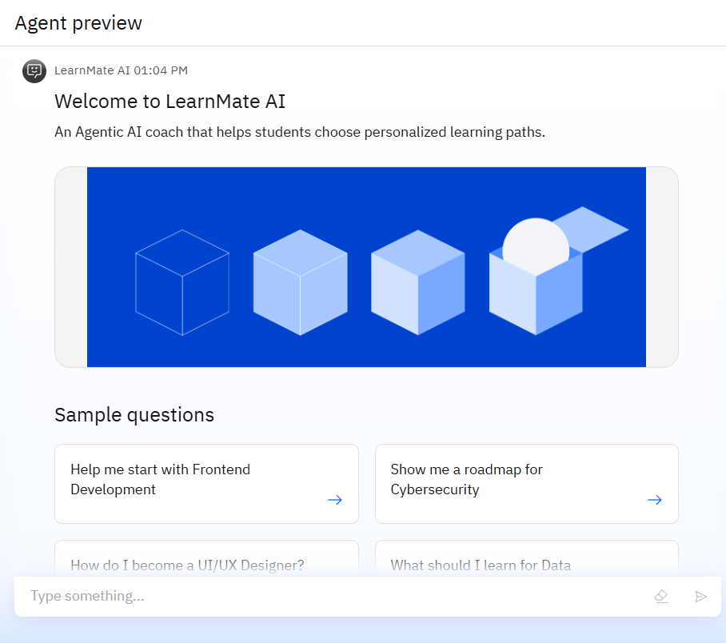
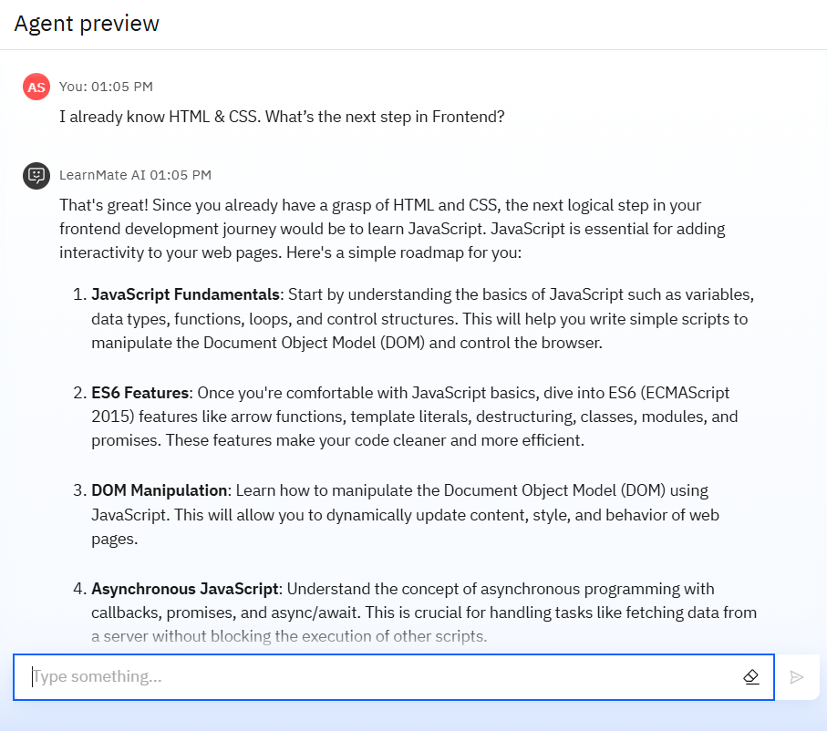
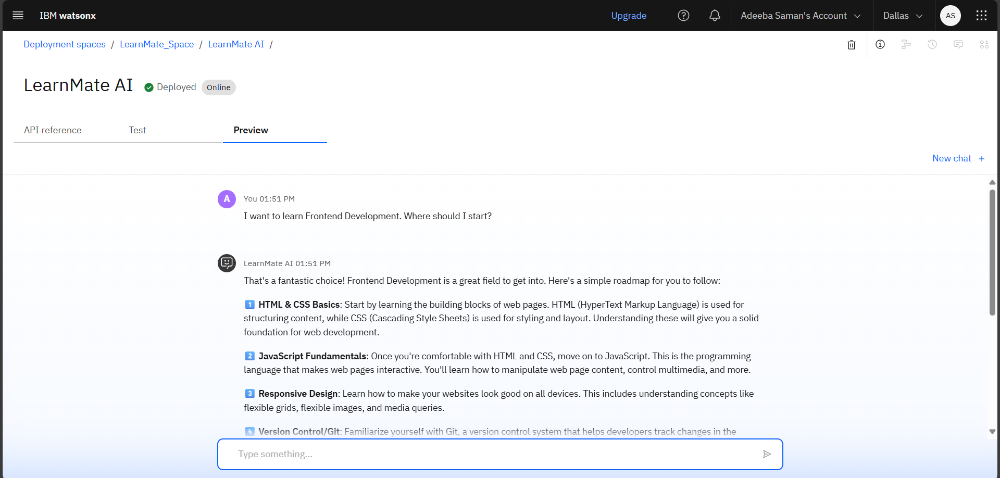
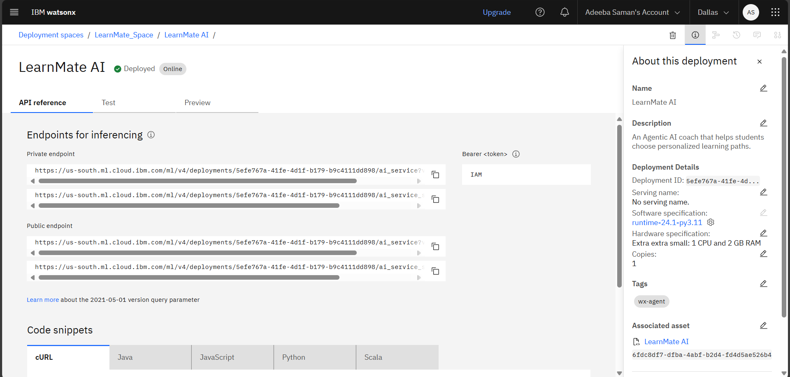

# 🎓 LearnMate AI – Agentic AI for Personalized Course Pathways

## 📖 Overview
LearnMate AI is an **Agentic AI coach** built entirely on **IBM watsonx.ai** using **Granite foundation models**.  
It helps students identify the **right learning path** by understanding their **interests** (e.g., Frontend Development, Cybersecurity, UI/UX Design) and assessing their **current skill level**.  
LearnMate then creates **dynamic, personalized roadmaps** that adapt over time, while suggesting **trusted tutorials and learning resources**.

---

## 🎯 What LearnMate Does
- 🗺 Creates **personalized learning roadmaps** for students.  
- 🎯 Handles **only education-related questions** and redirects irrelevant ones politely.  
- 📚 Suggests **trusted tutorials and resources** (e.g., freeCodeCamp, Traversy Media).  
- 🤖 Runs entirely on **IBM watsonx.ai Granite models** for natural conversations.  
- 👩‍🏫 Works for **all skill levels** – from beginners to advanced learners.

---

## 🌟 Key Highlights
- 💡 **Adaptive plans** – updates roadmaps as students progress or change interests.  
- ⚡ **No-code build** – fully created using IBM Agent Lab, no programming required.  
- 🎯 **Focused guidance** – keeps students on-topic and goal-oriented.  
- 📚 **Trusted sources only** – recommends verified, high-quality tutorials.  
- 🤝 **Mentor-like tone** – responds in a friendly, motivating way.

---

## 🏗 Technologies Used
- 🧠 **IBM watsonx.ai Studio** – for designing and managing the AI agent.  
- 🤖 **IBM Granite 3-8B Instruct Model** – powers natural, conversational learning guidance.  
- 🛠 **IBM Agent Lab** – no-code platform to build and deploy the agent.  
- 🌐 **Wikipedia & Google Search Tools** – fetch accurate, up-to-date educational resources.

---

## 📸 Screenshots

### 🔹 1. LearnMate Agent in Action

### 🔹 2. Roadmap Example for Frontend Development

### 🔹 3. Successfully Deployed Agent Page

### 🔹 4. API References from IBM watsonx.ai

---

## 🚀 What’s Next for LearnMate AI
- 🌍 **Multi-language support** to help global learners.  
- 🎙 **Voice-enabled conversations** for a natural learning experience.  
- 📂 **Integration with e-learning platforms** like Coursera, Udemy, and IBM SkillsBuild.  
- 📊 **Progress tracking** to auto-adjust learning paths.

---

